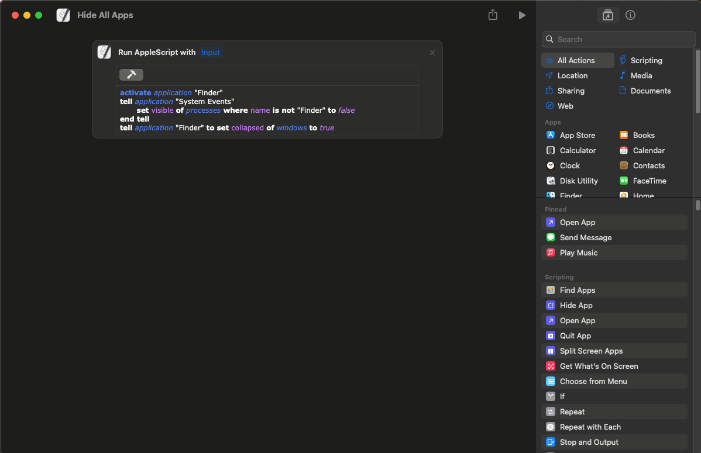
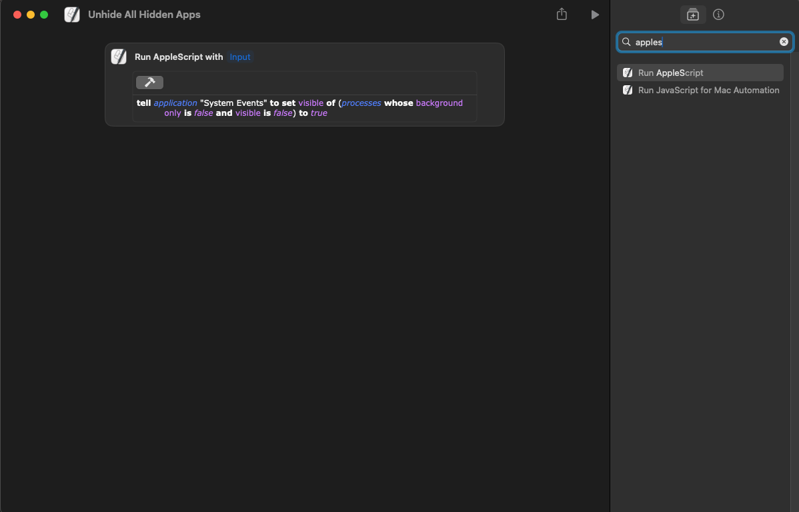

Credit: [Unhide All Hidden Apps](https://www.macscripter.net/t/unhiding-all-applications/49217/5)

Credit: [Hide All Apps](https://github.com/raycast/extensions/blob/3ce63d81417d797bddc903c9a0e1a82ba1fda54b/extensions/hide-all-apps/src/index.tsx)

Ported by: Unknown Crafts

# About

A set of shortcuts to enhance the hidden apps functionality in MacOS

# Jump to your desired shortcut:

- [Hide All Apps](https://github.com/UnknownCrafts/Regent/tree/main/Hidden%20Apps%20Utilities#hide-all-apps)
- [Unhide All Hidden Apps](https://github.com/UnknownCrafts/Regent/tree/main/Hidden%20Apps%20Utilities#unhide-all-hidden-apps)

# Hide All Apps

How to setup this shortcut:

**Automatic Shortcut Setup:**

Download the shortcut, [click me](https://github.com/UnknownCrafts/Regent/raw/main/Hidden%20Apps%20Utilities/shortcuts/Hide%20All%20Apps.shortcut), and then double click on the downloaded file to add it to the shortcuts app, you can delete the downloaded file after the shortcut has been added.

You are done, go ahead close the shortcuts app and enjoy using the shortcut in Monarch!

**Manual Way:**

Create a new shortcut, shortcuts://create-shortcut, copy and paste this into your browser.

Copy the text in the [hide-all-apps.applescript](scripts/hide-all-apps.applescript), and input it in the shortcuts app like so:

<picture>

</picture>

You are done, go ahead close the shortcuts app and enjoy using the shortcut in Monarch!

# Unhide All Hidden Apps

How to setup this shortcut:

**Automatic Shortcut Setup:**

Download the shortcut, [click me](https://github.com/UnknownCrafts/Regent/raw/main/Hidden%20Apps%20Utilities/shortcuts/Unhide%20All%20Hidden%20Apps.shortcut), and then double click on the downloaded file to add it to the shortcuts app, you can delete the downloaded file after the shortcut has been added.

You are done, go ahead close the shortcuts app and enjoy using the shortcut in Monarch!

**Manual Way:**

Create a new shortcut, shortcuts://create-shortcut, copy and paste this into your browser.

Copy the text in the [unhide-all-hidden-apps.applescript](scripts/unhide-all-hidden-apps.applescript), and input it in the shortcuts app like so:

<picture>

</picture>

You are done, go ahead close the shortcuts app and enjoy using the shortcut in Monarch!