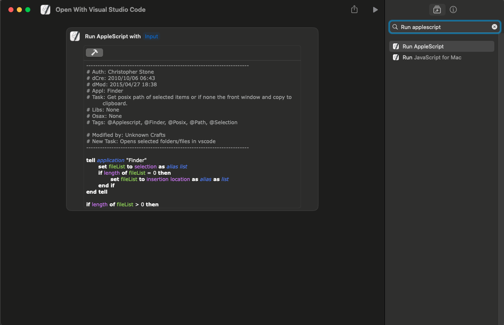

Credit: https://forum.keyboardmaestro.com/t/copy-path-of-finder-selection/1200/3
Edited by: Unknown Crafts

**How to setup this shortcut(automatic setup):**

Download the [<a href="Open With Visual Studio Code.shortcut" download>vscode shortcut</a>](https://github.com/UnknownCrafts/Regent/raw/main/Open%20With%20Visual%20Studio%20Code/Open%20With%20Visual%20Studio%20Code.shortcut) and double click on it to add it to the shortcuts app, you can delete the downloaded file after the shortcut has been added.

**How to setup this shortcut(manual setup):**

Create a new shortcut, shortcuts://create-shortcut, copy and paste this into your browser.

Copy the text in the [script.applescript](script.applescript), and input it in the shortcuts app like so:

<picture>

</picture>

Click the hammer button for goodluck :)

You are done, go ahead close the shortcuts app and enjoy using the shortcut in Monarch!