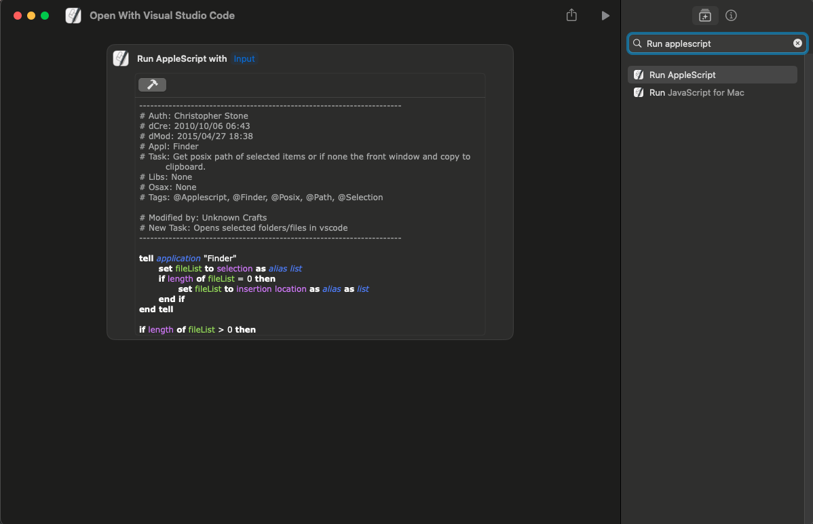

How to setup this shortcut:

Copy the text in the script.applescript, and input it in the shortcuts app like so:

<picture>

</picture>

You are done, go ahead close the shortcuts app and enjoy using the shortcut in Monarch!