Credit: https://github.com/raycast/extensions/tree/5b4c9c5bc4f4e5839609636a92062e8f5e79f030/extensions/screenshot
Ported by: Unknown Crafts

# About

A set of shortcuts ported from the raycast "Screenshot" extension.

# Capture Window To Clipboard

How to setup this shortcut:

**Automatic Shortcut Setup:**

Download the shortcut, [click me](https://github.com/UnknownCrafts/Regent/raw/main/Screenshot%20Utilities/shortcuts/Capture%20Window%20To%20Clipboard.shortcut), and then double click on the downloaded file to add it to the shortcuts app, you can delete the downloaded file after the shortcut has been added.

You are done, go ahead close the shortcuts app and enjoy using the shortcut in Monarch!

**Manual Way:**

Create a new shortcut, shortcuts://create-shortcut, copy and paste this into your browser.

Copy the text in the [capture-window-to-clipboard.sh](scripts/capture-window-to-clipboard.sh), and input it in the shortcuts app like so:

<picture>
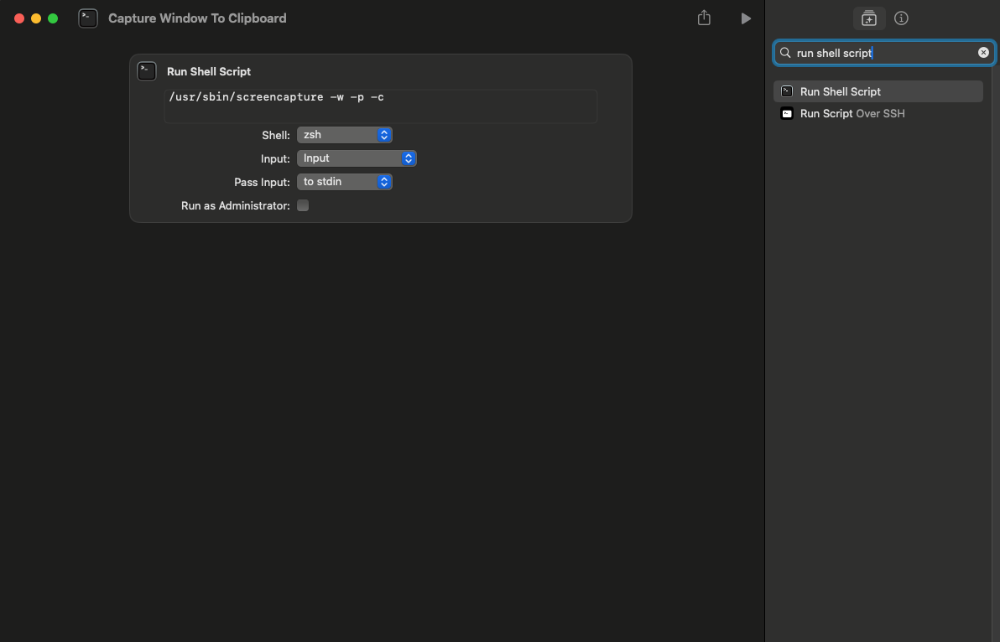
</picture>

You are done, go ahead close the shortcuts app and enjoy using the shortcut in Monarch!

# Capture Screen

How to setup this shortcut:

**Automatic Shortcut Setup:**

Download the shortcut, [click me](https://github.com/UnknownCrafts/Regent/raw/main/Screenshot%20Utilities/shortcuts/Capture%20Screen.shortcut), and then double click on the downloaded file to add it to the shortcuts app, you can delete the downloaded file after the shortcut has been added.

You are done, go ahead close the shortcuts app and enjoy using the shortcut in Monarch!

**Manual Way:**

Create a new shortcut, shortcuts://create-shortcut, copy and paste this into your browser.

Copy the text in the [capture-screen.sh](scripts/capture-screen.sh), and input it in the shortcuts app like so:

<picture>
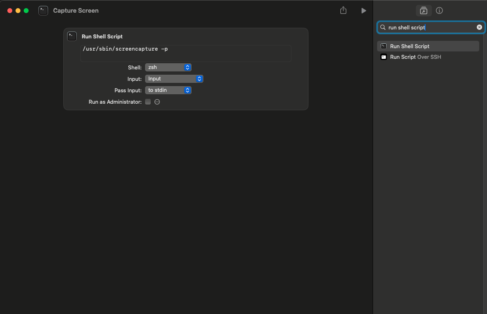
</picture>

You are done, go ahead close the shortcuts app and enjoy using the shortcut in Monarch!

# Capture Timer

How to setup this shortcut (This will be long so strap in):

**Automatic Shortcut Setup:**

Download the shortcut, [click me](https://github.com/UnknownCrafts/Regent/raw/main/Screenshot%20Utilities/shortcuts/Capture%20Timer.shortcut), and then double click on the downloaded file to add it to the shortcuts app, you can delete the downloaded file after the shortcut has been added.

Now use "cmd + h" to hide the shortcut command in monarch search as we will be setting up a superlink!
<picture>
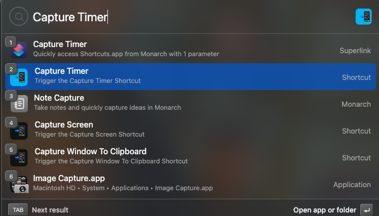
</picture>

To create a new superlink just do this in monarch search and press enter:
<picture>
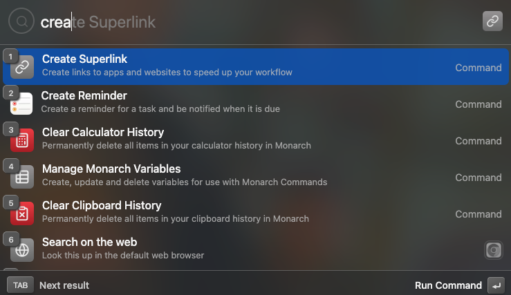
</picture>
Now the superlink editing menu should look similar to this (Monarch v0.6.6):

<picture>
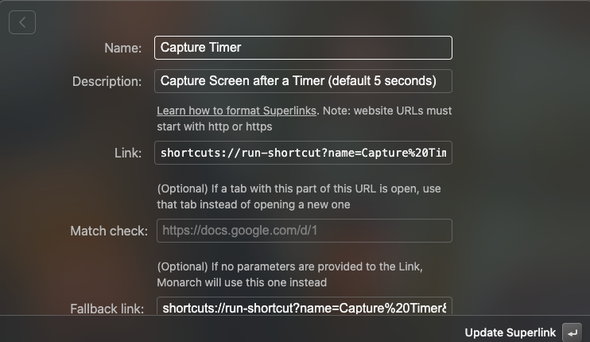
</picture>

You can learn more about url-based calling of shortcuts here: https://support.apple.com/en-ca/guide/shortcuts-mac/apd624386f42/mac

Now just copy and paste the following values in their respective text boxes:

Name: Capture Timer

Description: Capture Screen after a Timer (default 5 seconds)

Link: shortcuts://run-shortcut?name=Capture%20Timer&input={duration}

Fallback link: shortcuts://run-shortcut?name=Capture%20Timer&input=5
(The fallback link is what sends our default value of 5 seconds if no custom duration is inputted, you can change the 5 to whatever number you want)
<picture>
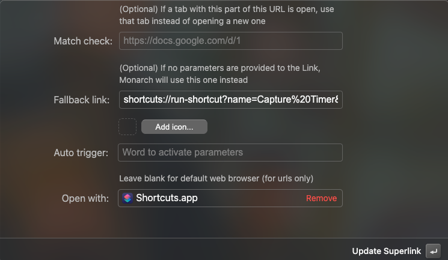
</picture>

Icon: You can choose whatever you want :)

Open with: Shortcuts.app

You are done, go ahead close the shortcuts app and enjoy using the shortcut in Monarch!

**Manual Way:**

Create a new shortcut, shortcuts://create-shortcut, copy and paste this into your browser.

Create a variable in the shortcuts app:

<picture>
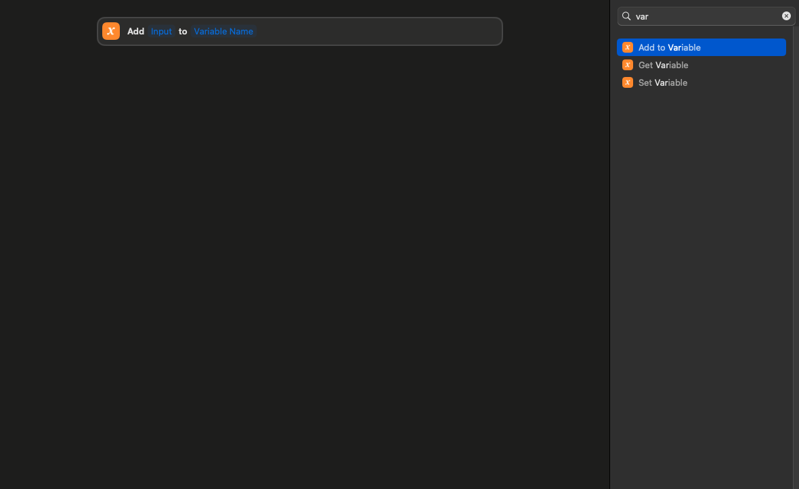
</picture>
Set the "Input" to "Shortcut Input" and the variable name to anything that you like. I am choosing to use "Duration"

Now copy the text in the [capture-timer.sh](scripts/capture-timer.sh), and input it in the shortcuts app like so:

<picture>
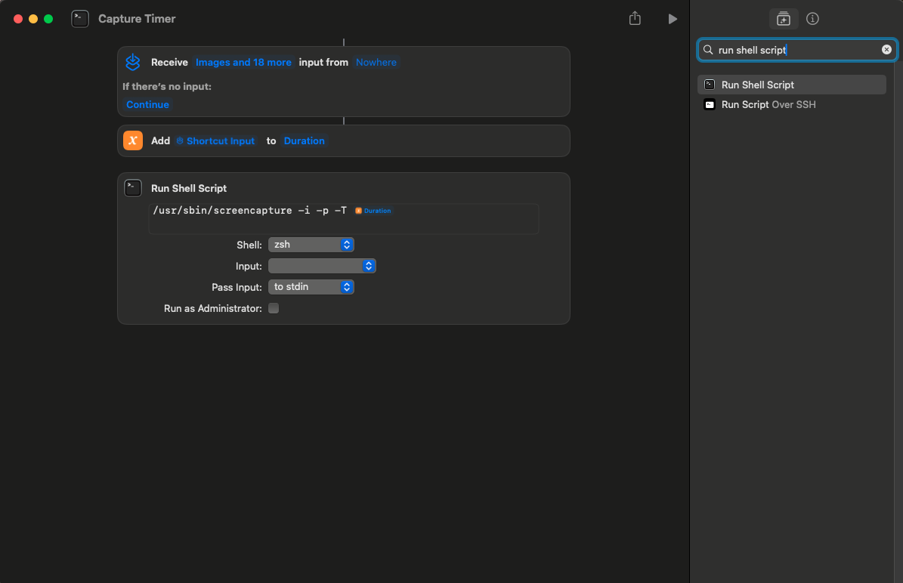
</picture>

In the "Input" field of the shell script, choose your newly created variable and write that variable name at the end of the script (the variable name should get highlighted like in the image above, if you chose a different variable name then make sure to put that instead of "Duration" in the end of the shell script. e.g /usr/sbin/screencapture -i -p -T "your-variable-name", replace everything in and including the quotes with your variable name and yes it is case sensitive.)

Now use "cmd + h" to hide the shortcut command in monarch search as we will be setting up a superlink!
<picture>

</picture>

To create a new superlink just do this in monarch search and press enter:
<picture>

</picture>
Now the superlink editing menu should look similar to this (Monarch v0.6.6):

<picture>

</picture>

You can learn more about url-based calling of shortcuts here: https://support.apple.com/en-ca/guide/shortcuts-mac/apd624386f42/mac

Now just copy and paste the following values in their respective text boxes:

Name: Capture Timer

Description: Capture Screen after a Timer (default 5 seconds)

Link: shortcuts://run-shortcut?name=Capture%20Timer&input={duration}

Fallback link: shortcuts://run-shortcut?name=Capture%20Timer&input=5
(The fallback link is what sends our default value of 5 seconds if no custom duration is inputted, you can change the 5 to whatever number you want)
<picture>

</picture>

Icon: You can choose whatever you want :)

Open with: Shortcuts.app

You are done, go ahead close the shortcuts app and enjoy using the shortcut in Monarch!

# Capture to Clipboard

How to setup this shortcut:

**Automatic Shortcut Setup:**

Download the shortcut, [click me](https://github.com/UnknownCrafts/Regent/raw/main/Screenshot%20Utilities/shortcuts/Capture%20to%20Clipboard.shortcut), and then double click on the downloaded file to add it to the shortcuts app, you can delete the downloaded file after the shortcut has been added.

You are done, go ahead close the shortcuts app and enjoy using the shortcut in Monarch!

**Manual Way:**

Create a new shortcut, shortcuts://create-shortcut, copy and paste this into your browser.

Copy the text in the [capture-to-clipboard.sh](scripts/capture-to-clipboard.sh), and input it in the shortcuts app like so:

<picture>
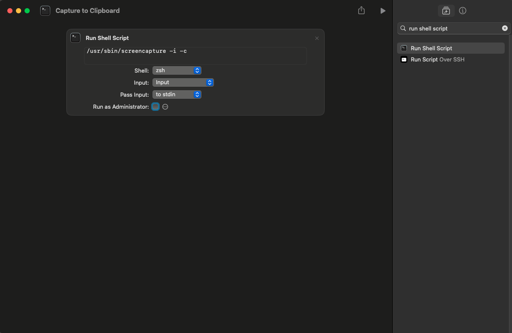
</picture>

You are done, go ahead close the shortcuts app and enjoy using the shortcut in Monarch!

# Capture and Annotate

How to setup this shortcut:

**Automatic Shortcut Setup:**

Download the shortcut, [click me](https://github.com/UnknownCrafts/Regent/raw/main/Screenshot%20Utilities/shortcuts/Capture%20And%20Annotate.shortcut), and then double click on the downloaded file to add it to the shortcuts app, you can delete the downloaded file after the shortcut has been added.

You are done, go ahead close the shortcuts app and enjoy using the shortcut in Monarch!

**Manual Way:**

Create a new shortcut, shortcuts://create-shortcut, copy and paste this into your browser.

Copy the text in the [annotate.sh](scripts/annotate.sh), and input it in the shortcuts app like so:

<picture>

</picture>

You are done, go ahead close the shortcuts app and enjoy using the shortcut in Monarch!

# All in One

How to setup this shortcut:

**Automatic Shortcut Setup:**

Download the shortcut, [click me](https://github.com/UnknownCrafts/Regent/raw/main/Screenshot%20Utilities/shortcuts/All%20in%20One.shortcut), and then double click on the downloaded file to add it to the shortcuts app, you can delete the downloaded file after the shortcut has been added.

You are done, go ahead close the shortcuts app and enjoy using the shortcut in Monarch!

**Manual Way:**

Create a new shortcut, shortcuts://create-shortcut, copy and paste this into your browser.

Copy the text in the [all-in-one.sh](scripts/all-in-one.sh), and input it in the shortcuts app like so:

<picture>
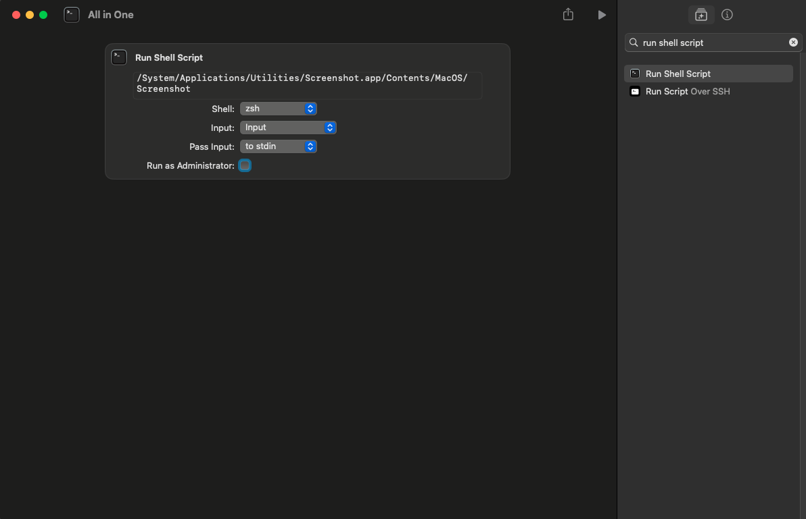
</picture>

You are done, go ahead close the shortcuts app and enjoy using the shortcut in Monarch!

# Capture Area

How to setup this shortcut:

**Automatic Shortcut Setup:**

Download the shortcut, [click me](https://github.com/UnknownCrafts/Regent/raw/main/Screenshot%20Utilities/shortcuts/Capture%20Area.shortcut), and then double click on the downloaded file to add it to the shortcuts app, you can delete the downloaded file after the shortcut has been added.

You are done, go ahead close the shortcuts app and enjoy using the shortcut in Monarch!

**Manual Way:**

Create a new shortcut, shortcuts://create-shortcut, copy and paste this into your browser.

Copy the text in the [capture-area.sh](scripts/capture-area.sh), and input it in the shortcuts app like so:

<picture>
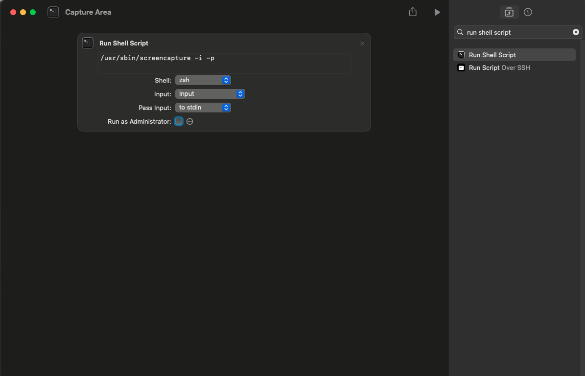
</picture>

You are done, go ahead close the shortcuts app and enjoy using the shortcut in Monarch!

# Capture Window

How to setup this shortcut:

**Automatic Shortcut Setup:**

Download the shortcut, [click me](https://github.com/UnknownCrafts/Regent/raw/main/Screenshot%20Utilities/shortcuts/Capture%20Window.shortcut), and then double click on the downloaded file to add it to the shortcuts app, you can delete the downloaded file after the shortcut has been added.

You are done, go ahead close the shortcuts app and enjoy using the shortcut in Monarch!

**Manual Way:**

Create a new shortcut, shortcuts://create-shortcut, copy and paste this into your browser.

Copy the text in the [capture-window.sh](scripts/capture-window.sh), and input it in the shortcuts app like so:

<picture>

</picture>

You are done, go ahead close the shortcuts app and enjoy using the shortcut in Monarch!