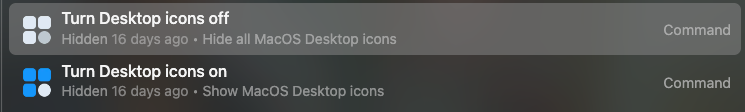
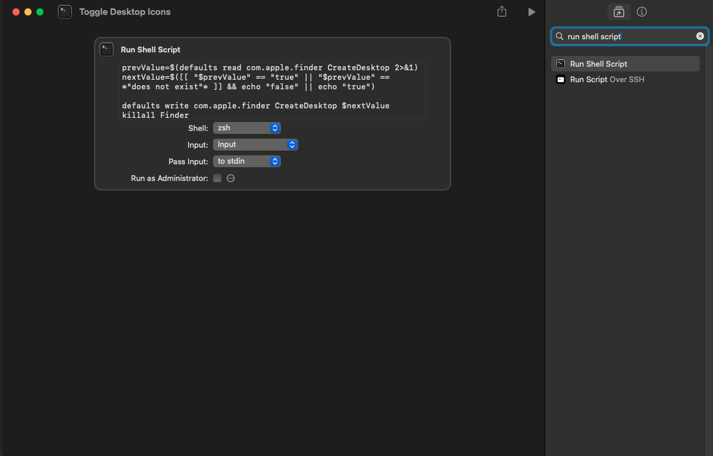

Credit: https://gist.github.com/mjackson/6d0748fe44687877d3e44e0ef9172c9b
Edited by: Unknown Crafts

**How to setup this shortcut:**

**Automatic Shortcut Setup:**

Download the shortcut, [click me](https://github.com/UnknownCrafts/Regent/raw/main/Toggle%20Desktop%20Icons/Toggle%20Desktop%20Icons.shortcut), and then double click on the downloaded file to add it to the shortcuts app, you can delete the downloaded file after the shortcut has been added.

Next:

Hide these in the root search by doing "cmd + h" when the command is highlighted in Monarch launcher.

<picture>

</picture>

You are done, go ahead close the shortcuts app and enjoy using the shortcut in Monarch!

**Manual Way:**
Create a new shortcut, shortcuts://create-shortcut, copy and paste this into your browser.

Copy the text in the [script.sh](script.sh), and input it in the shortcuts app like so:

<picture>

</picture>

Next:

Hide these in the root search by doing "cmd + h" when the command is highlighted in Monarch launcher.

<picture>

</picture>

You are done, go ahead close the shortcuts app and enjoy using the shortcut in Monarch!