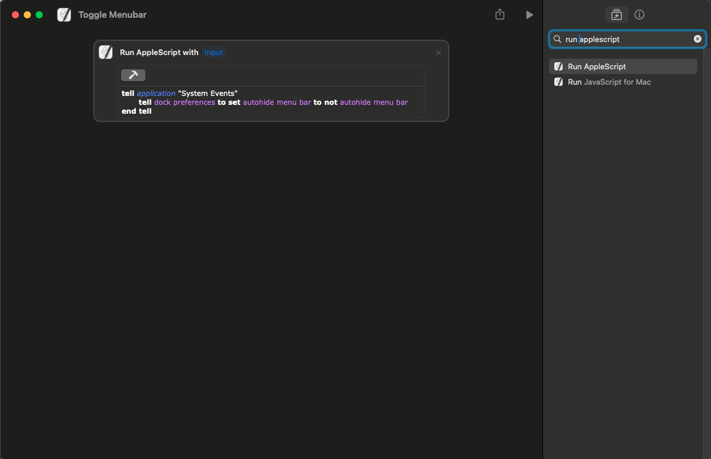

Credit: https://www.reddit.com/r/applescript/comments/107r8pq/apple_script_to_hide_or_unhide_the_menubar_and/
Edited by: Unknown Crafts

How to setup this shortcut:

Create a new shortcut, [click me](shortcuts://create-shortcut "Create a new shortcut hyperlink")

Copy the text in the script.applescript, and input it in the shortcuts app like so:

<picture>

</picture>

Click the hammer button for goodluck :)

You are done, go ahead close the shortcuts app and enjoy using the shortcut in Monarch!